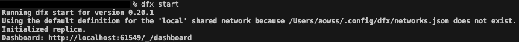
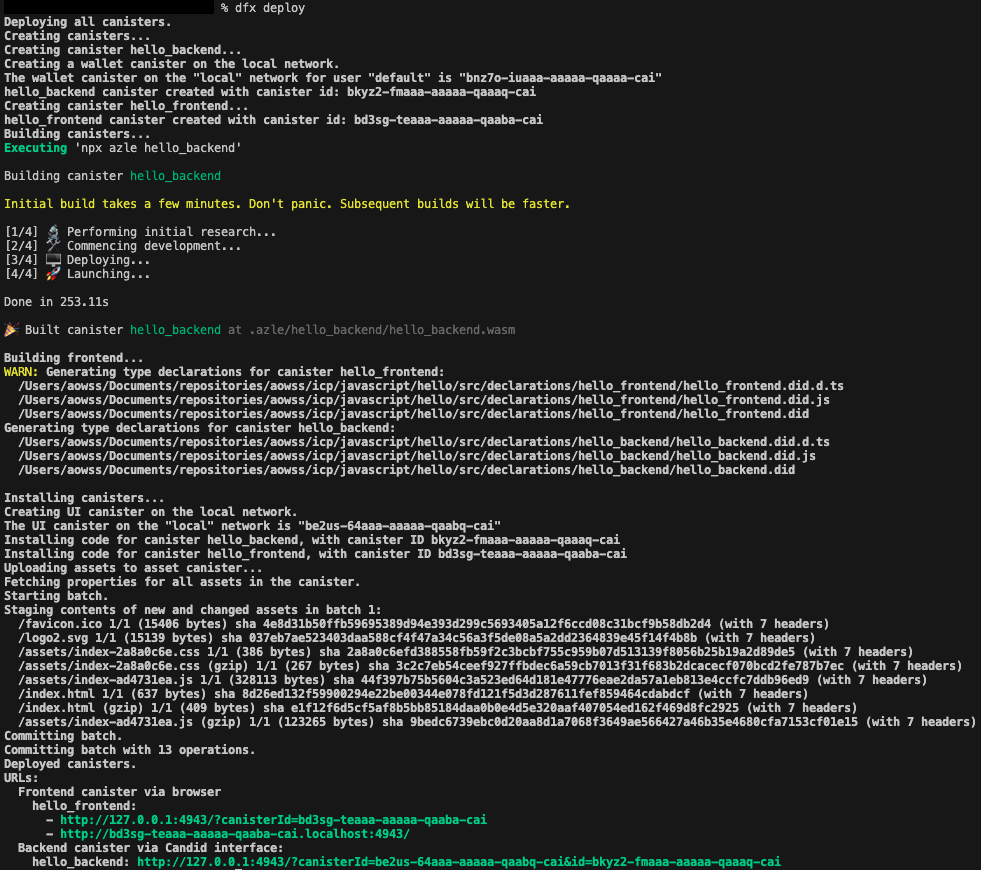

<!-- TOC -->
* [Getting started with ICP](#getting-started-with-icp)
  * [Installation](#installation)
  * [Development](#development)
  * [Deployment](#deployment)
  * [Execution](#execution)
* [Resources](#resources)
<!-- TOC -->

# Getting started with ICP

## Installation

1. Install [`dfx`](https://internetcomputer.org/docs/current/developer-docs/developer-tools/dev-tools-overview#dfx)

`dfx`, a.k.a. IC SDK, is the primary tool used by developers to create, build, deploy, manage, and call canisters.

* Install [`dfxvm`](https://internetcomputer.org/docs/current/developer-docs/developer-tools/dev-tools-overview#dfxvm)

`dfxvm` is a command-line tool used to install and switch between different versions of `dfx`. Think [`nvm`](https://github.com/nvm-sh/nvm) for [`Node.js`](https://nodejs.org).

> `sh -ci "$(curl -fsSL https://internetcomputer.org/install.sh)"`

This will automatically install `dfx`.

2. Install the CDK for your language

By default, `dfx` will automatically install the [Mokoto](https://internetcomputer.org/docs/current/developer-docs/getting-started/install/#motoko), [Rust](https://internetcomputer.org/docs/current/developer-docs/getting-started/install/#rust), [TypeScript](https://internetcomputer.org/docs/current/developer-docs/getting-started/install/#typescript--javascript) and other CDKs.

3. Install [`Node.js`](https://nodejs.org)

## Development

1. Start a local ICP instance

> `dfx start`



2. Create a new project

> `dfx new hello`

If you choose `TypeScript` as the language, [Vue.js](https://vuejs.org/) as the frontend framework and add the frontend tests feature, you get the following project structure ( `tree --dirsfirst -I 'node_modules|.git' -a -L 4 hello` ):

```
hello
├── src
│   ├── hello_backend
│   │   ├── hello_backend.did
│   │   ├── package.json
│   │   └── src
│   │       └── index.ts
│   └── hello_frontend
│       ├── index.html
│       ├── package.json
│       ├── public
│       │   ├── favicon.ico
│       │   └── logo2.svg
│       ├── src
│       │   ├── App.vue
│       │   ├── index.scss
│       │   ├── main.js
│       │   └── vite-env.d.ts
│       ├── tsconfig.json
│       └── vite.config.js
├── .env
├── .gitignore
├── README.md
├── dfx.json
├── package-lock.json
├── package.json
└── tsconfig.json
```

* The generated app's code ( [`index.ts`](javascript/hello/src/hello_backend/src/index.ts) ) is:

```typescript
import { Canister, query, text } from 'azle';

export default Canister({
    greet: query([text], text, (name) => {
        return `Hello, ${name}!`;
    })
})
```

* The generated [`.did` file](javascript/hello/src/hello_backend/hello_backend.did) describes the services ( see [here](https://internetcomputer.org/docs/current/tutorials/developer-journey/level-2/2.4-intro-candid/#the-did-file) for more details ) and is as follows:

```rust
service: () -> {
    greet: (text) -> (text) query;
}
```

* The generated [`dfx.json` file](javascript/hello/dfx.json) lists the canisters and their dependencies

## Deployment

Deploy the project canisters locally:

> `cd hello`  
> `dfx deploy`



This will create a [`.azle`](javascript/hello/.azle) and a [`.dfx`](javascript/hello/.dfx) directory at the root.

## Execution

From the `hello` directory, you can call the smart contract using this command:

> `dfx canister call hello_backend greet world`

The command format is: `dfx canister call <<contract_name>> <<function_name>> <<function_parameters>>`

* You can use the contract name `hello_backend` because the smart contracts were deployed to the testnet in the previous step and their addresses were saved in the [`.dfx/local/canister_ids.json`](javascript/hello/.dfx/local/canister_ids.json) file:

```json
{
  "__Candid_UI": {
    "local": "be2us-64aaa-aaaaa-qaabq-cai"
  },
  "hello_backend": {
    "local": "bkyz2-fmaaa-aaaaa-qaaaq-cai"
  },
  "hello_frontend": {
    "local": "bd3sg-teaaa-aaaaa-qaaba-cai"
  }
}
```

# Resources

. [ICP Developer Documentation](https://internetcomputer.org/docs/current/developer-docs)
